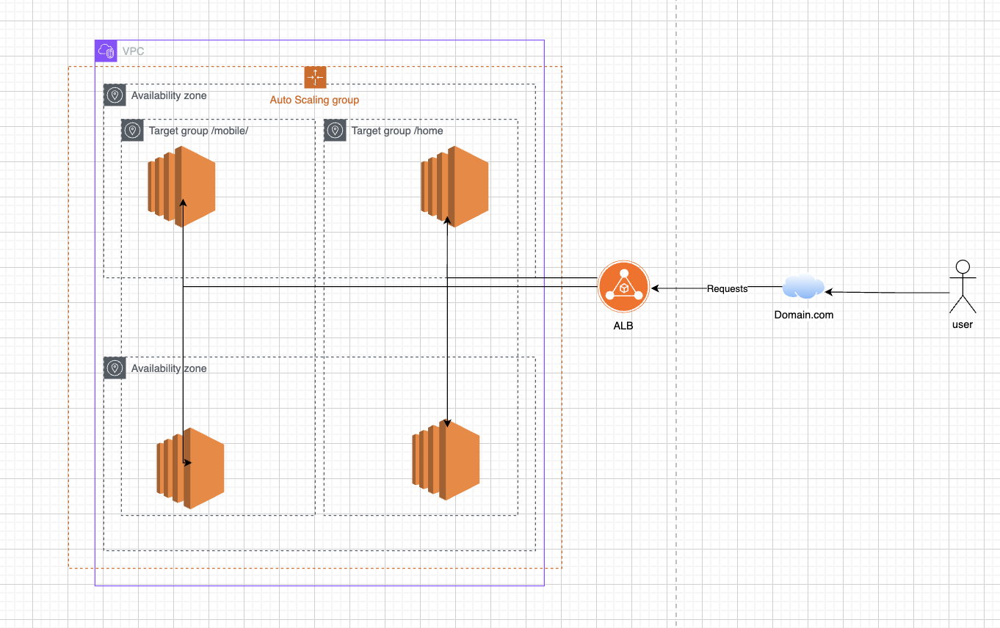

## The EC2 Auto Scaling service enables automatically launching EC2 instances based on pre-defined conditions named scaling policies. A common scenario for auto scaling is launching more instances to cope with a sudden demand increase.

## Launch Template: it allows creating EC2 configurations so the service knows what type of EC2 instance to create when needed;
Auto Scaling Groups: a logical group of EC2 instances controlled by the auto scaling service.

# Architecture diagram 

# Steps to create an Auto Scalling Group (ASG)

## step 1 - create an asg 
