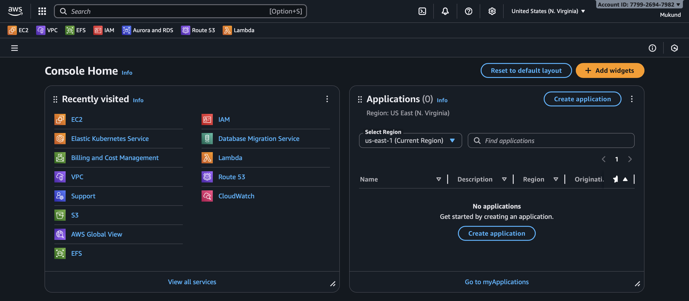
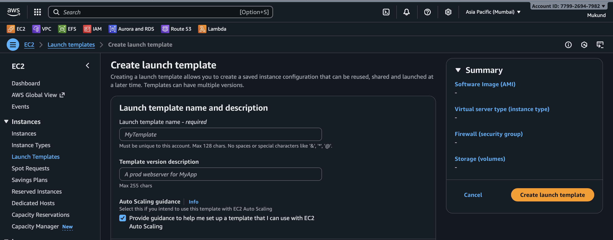
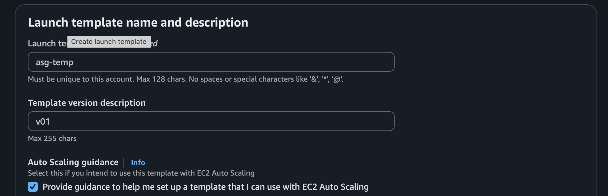
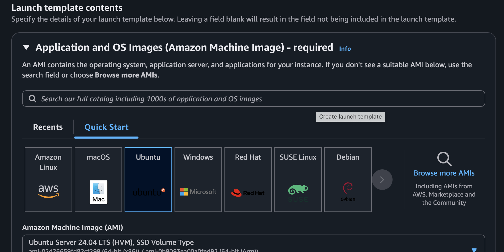
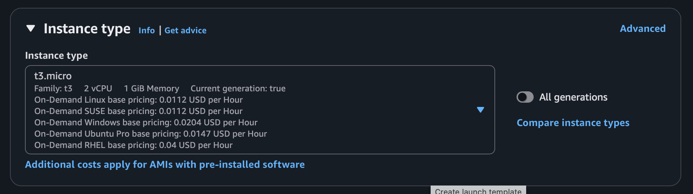
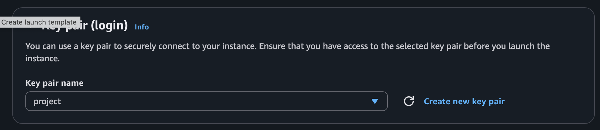
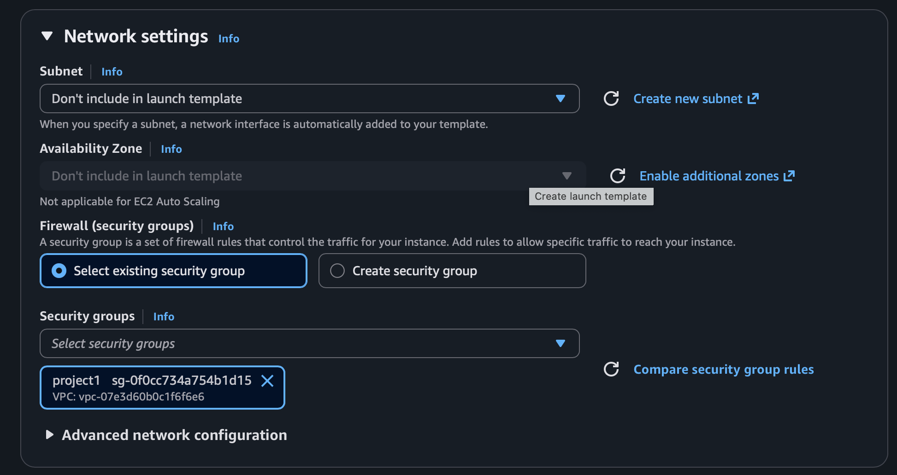
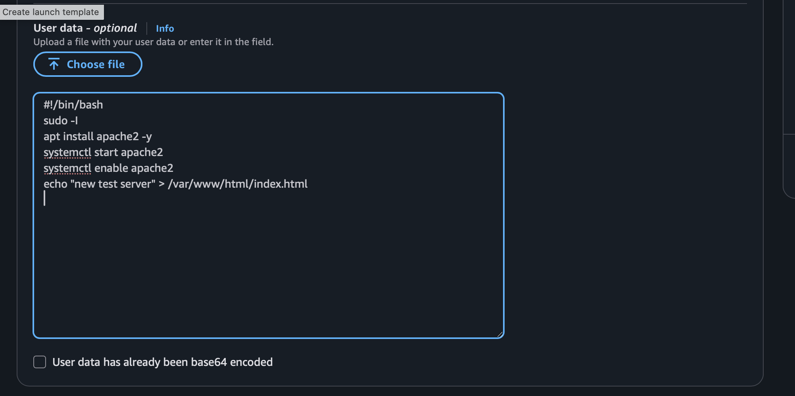
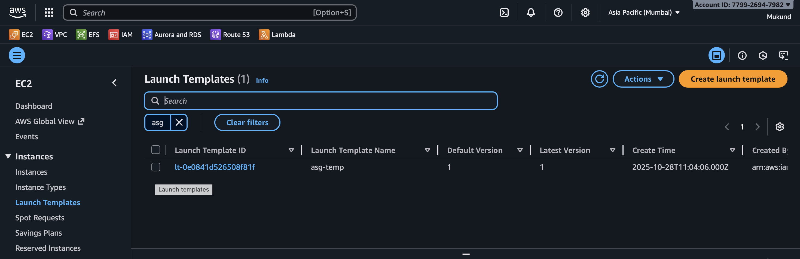

# steps to create a lanch template 

## 1. Open the AWS Management Console and navigate to the EC2 service.

## 2. In the left-hand menu, click on "Launch Templates" under the "Instances" section.

## 3. Click the "Create launch template" button.

## 4. Provide a name and an optional description for your launch template.

## 5. Configure the launch template settings, including:
   - AMI ID: Select the Amazon Machine Image you want to use.
     
   - Instance Type: Choose the instance type (e.g., t2.micro).
     
   - Key Pair: Select an existing key pair or create a new one for SSH access.
     
   - Security Groups: Choose existing security groups or create new ones to define firewall rules.
     
   - Storage: Configure the storage options for your instance.
  

## 6. Advance configuration configured for the launch template.

## 7. enter create lanch template 
## 8. To check created lanch template, go to "Launch Templates" in the EC2 dashboard and you will see the list of created launch templates.

