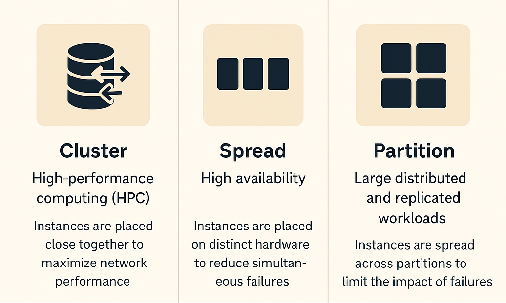
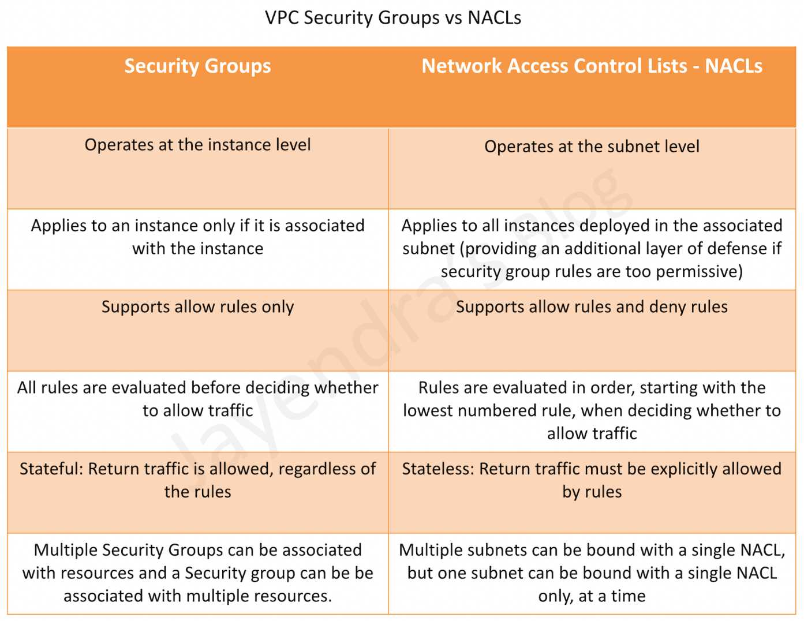

## Elastic IP
An Elastic IP address is a static, public IPv4 address designed for dynamic cloud computing. It is associated with your AWS account and can be easily remapped to any instance in your account, allowing you to maintain a consistent IP address even if you stop and start your instances.

## Placement Group!

A placement group is a logical grouping of instances within a single Availability Zone. Placement groups are used to meet the needs of applications that benefit from low network latency, high throughput, or both. There are two types of placement groups: cluster placement groups and spread placement groups.

## NACL vs SG!

Network Access Control Lists (NACLs) and Security Groups (SGs) are both used to control traffic to and from AWS resources, but they operate at different levels and have different use cases.

- **NACLs** are stateless, meaning that they evaluate traffic in both directions (inbound and outbound) separately. They are applied at the subnet level and can be used to allow or deny traffic based on IP addresses, protocols, and ports.

- **Security Groups**, on the other hand, are stateful. This means that if you allow an inbound request from a specific IP address, the response is automatically allowed, regardless of outbound rules. Security Groups are applied at the instance level and are typically used to control access to specific resources.
