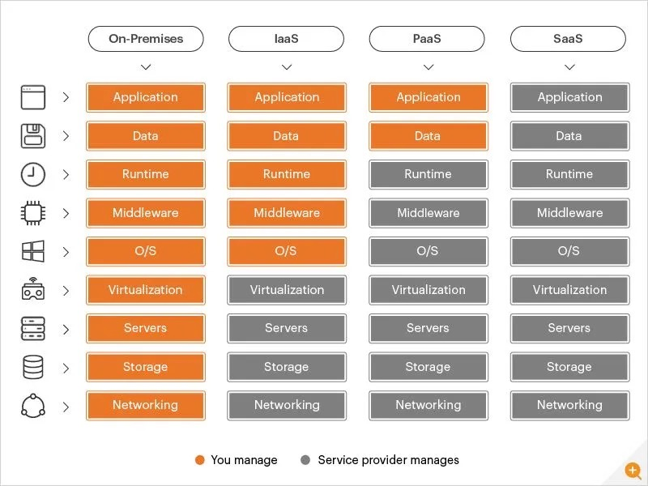

## revise 

- # Virtualization
- https://www.redhat.com/en/topics/virtualization/what-is-virtualization
- Virtualization is a technology that allows you to create virtual, simulated environments from a single, physical machine. Through this process, IT professionals can make use out of their previous investments and optimize a physical machine’s full capacity by distributing resources that are traditionally bound to hardware across many different environments.


# Virtualization vs Cloud
- https://www.redhat.com/en/topics/cloud-computing/cloud-vs-virtualization
- Virtualization is the creation of virtual versions of physical resources, while cloud computing delivers those resources over the internet as services.


- Cloud Models (IAAS, PAAS, SAAS)



- Region vs Availability Zone (AZ)
Region
- AWS regions are separate geographic areas that has clusters of data centers.
- Each region is completely independent and isolated from other regions.

Availability Zones
- Availability Zones (AZs) are isolated locations within a region.
- Each region has multiple AZs, which are designed to be independent from each other.


## EBS
EBS volume and its types 
attach/detach EBS volume to/from EC2 instance and create partaion 

## what are AWS storage types?
- S3 (object storage)
- EBS (block storage)
- EFS (file storage)

## AWS EBS storage types
SSD 
- General Purpose SSD (gp2 and gp3)
- Provisioned IOPS SSD (io1 and io2)

HDD
- Throughput Optimized HDD (st1)
- Cold HDD (sc1)

- Magnetic (standard)

```
df -hT    #to check file system type and disk space usage
lsblk     #to check block devices and mount points
fdisk /dev/xvdf   #to create partition on EBS volume and protocols.

```
## snapshot 
- A snapshot is a point-in-time copy of an EBS volume.
- Snapshots are stored in Amazon S3 and can be used to create new EBS volumes

snapshot policy 
- You can automate the creation and deletion of EBS snapshots using snapshot policies.
- Snapshot policies allow you to define schedules and retention periods for your snapshots.

